# Burp Proxy を利用する

本講義の中では、Web アプリケーションの解析・検証をするために、HTTP/HTTPS 通信の内容を精査したり、その中身を書き換えたりしていくことになります。
このような操作のためには Burp Suite が非常に便利ですから、まずは Burp Suite に含まれる各種ツールに慣れるところから始めましょう。

本章では、Burp Suite の中で最もベーシックな機能であると言っても過言ではない [Burp Proxy](https://portswigger.net/burp/documentation/desktop/tools/proxy) を利用して、HTTP/HTTPS 通信の中身を閲覧する方法を説明します。

## Burp Suite を起動する

TODO

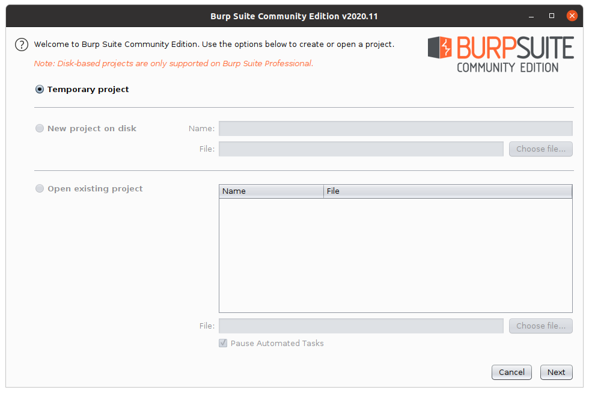

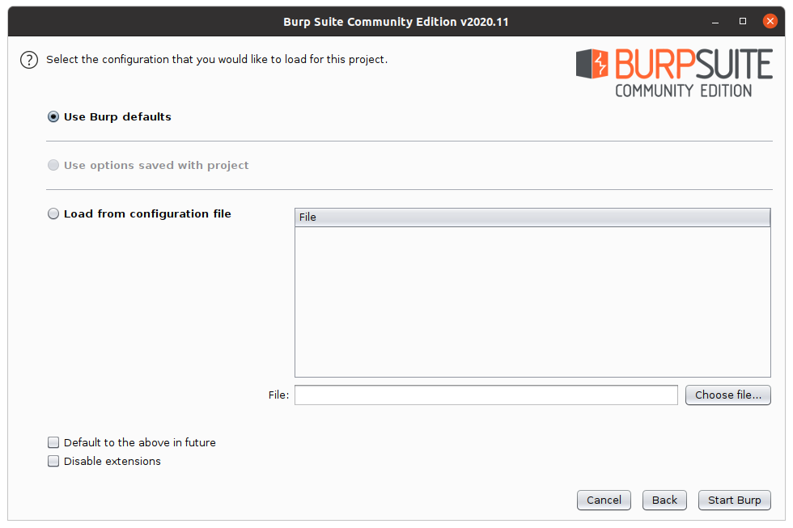

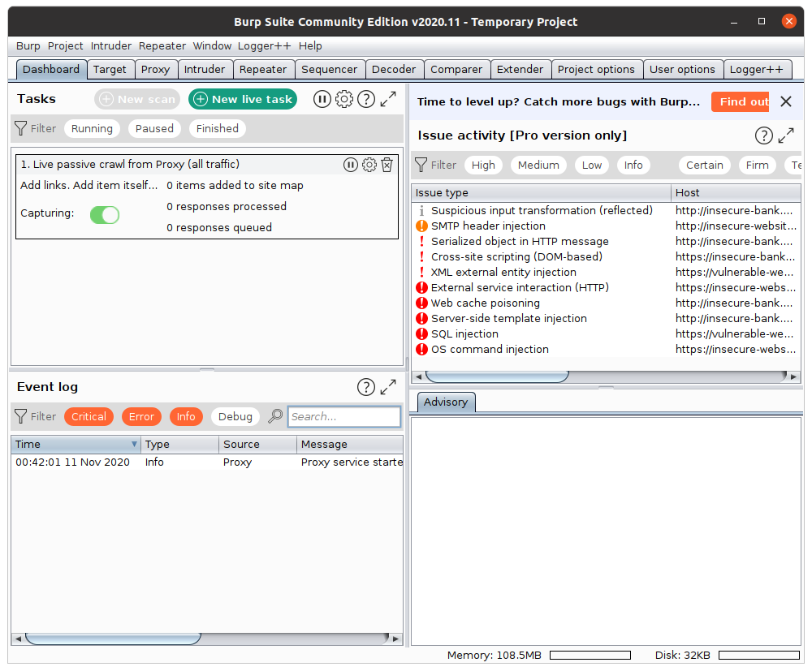

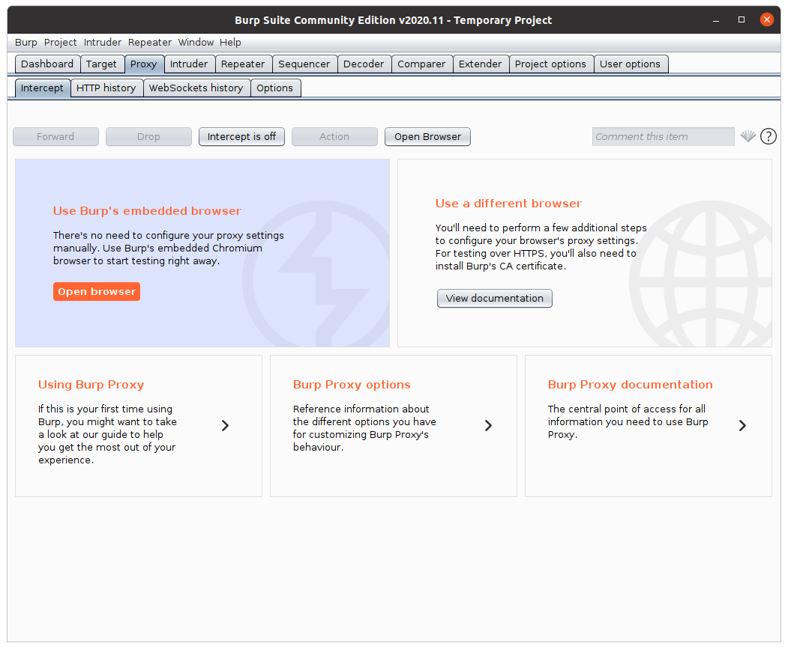

## ブラウザの設定をする

TODO

[SwitchyOmega](https://chrome.google.com/webstore/detail/proxy-switchyomega/padekgcemlokbadohgkifijomclgjgif)

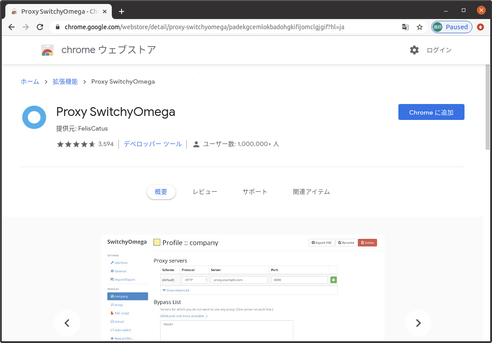

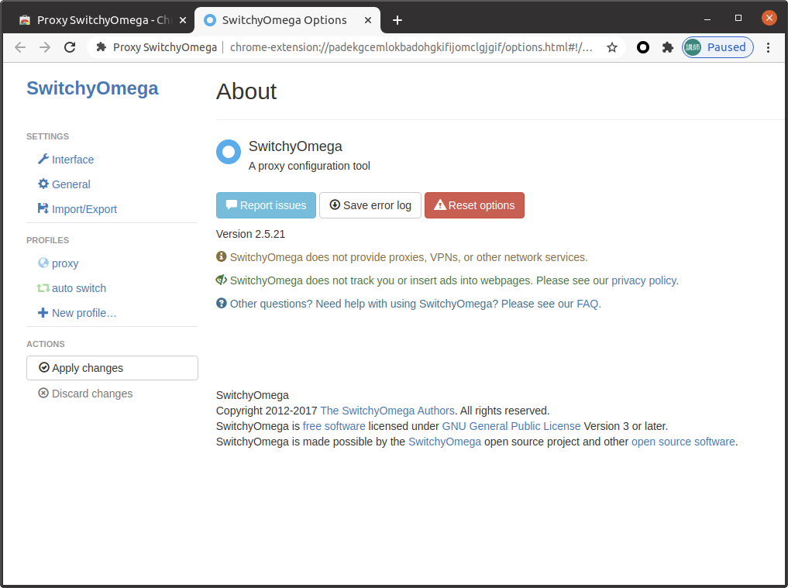

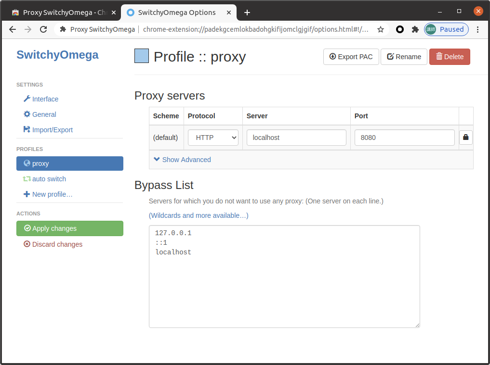

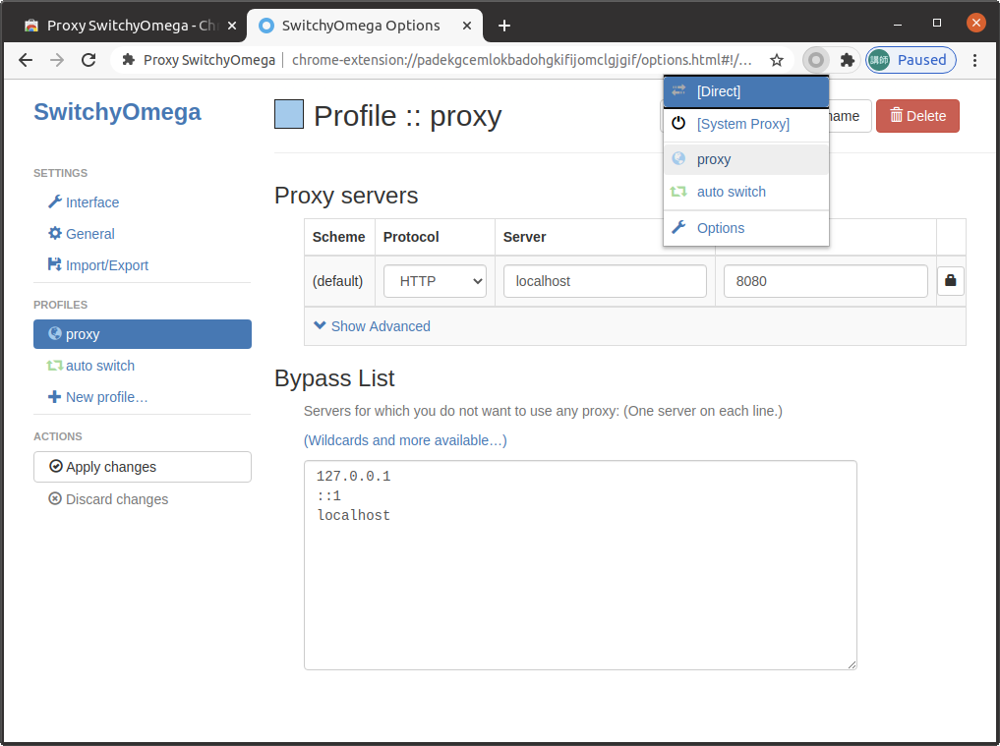

## HTTP 通信のログを確認する

TODO

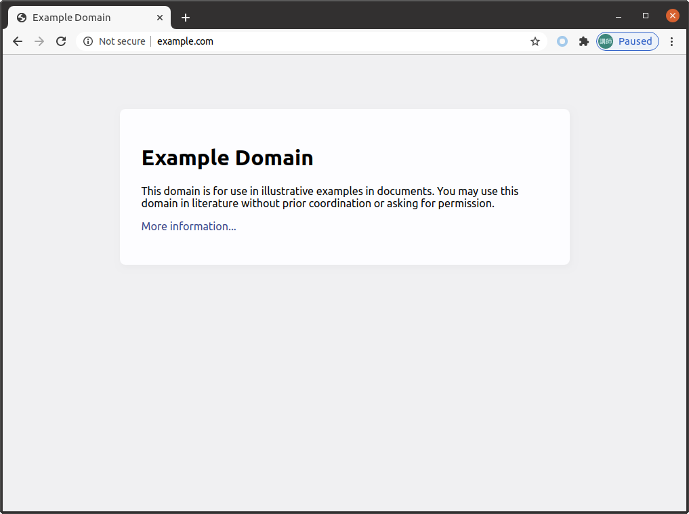

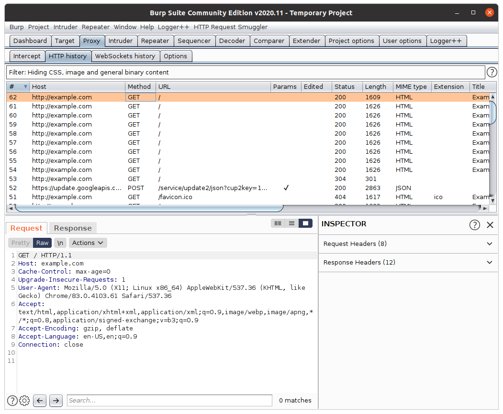

## HTTPS 通信を閲覧するための設定をする

TODO

[Here](https://portswigger.net/burp/documentation/desktop/getting-started/proxy-setup/certificate)

## HTTPS 通信のログを確認する

TODO

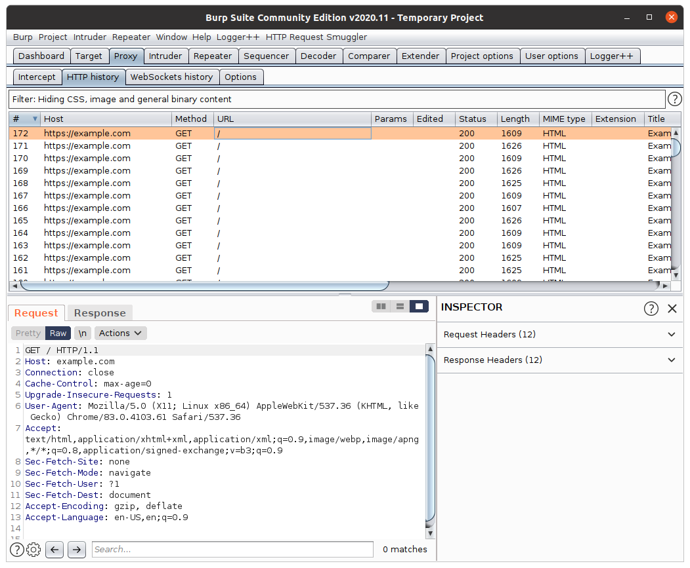

## 通信をインターセプトする

TODO

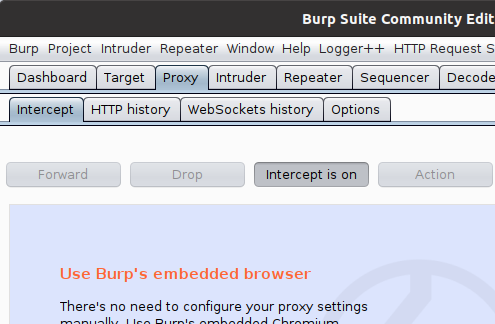

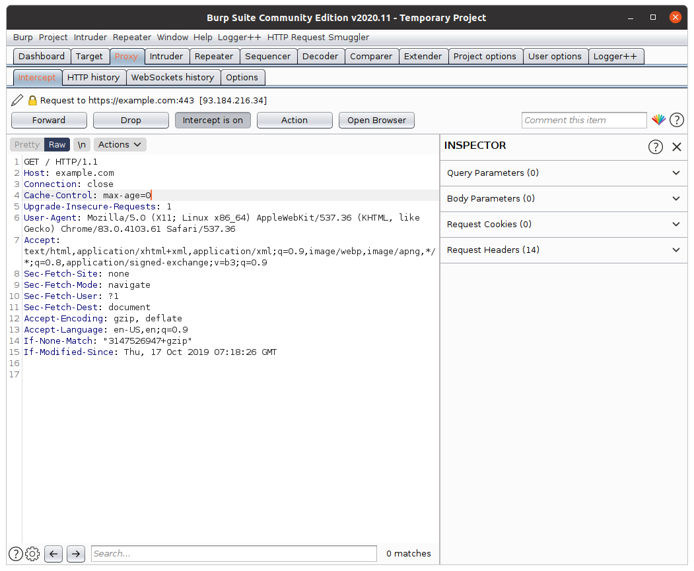